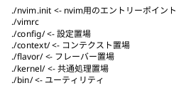
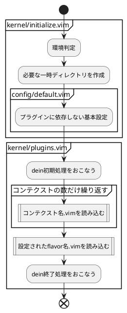
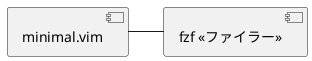

# vimrc-framework

VIMの設定を効率よく変更する為に、フレームワーク化する


## 要求

1. VIMを使いたい状況は色々ある。
   サーバで設定ファイルを触る時、
   PHPを書く時、HTMLを書く時。
   デスクトップでドキュメントを書く時とか。
1. キーマップ、テーマなど趣味によるものは機能と分けて管理する
1. プラグインは導入しやすいように参考になる初期設定を管理する

## 基本設計

### 共通処理

共通処理となりうるもの

1. 環境判定
1. 設定するための処理関数

### システム構成

**依存ライブラリ**

- 
  - [dein.vim](https://github.com/Shougo/dein.vim) 
  - プラグイン管理用プラグイン

### プラグインの利用

1. `default/プラグイン名.vim`にインストールと基本的な設定を記述する
1. 使用したい`contex/コンテキスト名.vim`で`LoadSource('プラグイン名')`で呼び出す

### ContextとFlavor

作ろうとする設定をContextかFlavorかで分けて考える。

Contextは拡張機能の導入を中心に設計し、
Flavorはキーマップ、見た目の設定を中心に設計する。

どちらからも `toml/context` もしくは `toml/flavor` を利用できるものとする。


## 詳細設計

### 共通処理

- オートコマンドグループ名は`NoraAutoCmd`とする
- 新しいコンテキストを設計する場合は、READMEに追記する
- 新しいフレーバを設計する場合は、READMEに追記する
- 

### ファイル構成



### プロセス



## コンテキスト設計

### Context: minimal

コンセプト:
    最小限の設定で立ち上げる



### Context: editor

コンセプト: エディターツールとしての便利セット

```plantuml
rectangle minimal << Context >>{
}
rectangle editor << Context >>{
package ファイラー {
    [NERDTree]
}
package 整形ツール群 {
}
}
minimal <|-- editor : 継承
```
#### 基本ツール

* * h1mesuke/vim-alignta.git
  * 整列
* * tomtom/tcomment_vim
  * コメントトグル
* * tpope/vim-surround
  * 囲む
* * terryma/vim-expand-region
  * 選択範囲を増やす
* * easymotion/vim-easymotion
  * ショートカットで移動する
* * yuttie/comfortable-motion.vim
  * スクロールをスムーズ
* * sheerun/vim-polyglot
  * シンタックス詰め合わせ
* * jiangmiao/auto-pairs
  * 自動でペアを入力する
  
#### NERDTree

* * scrooloose/nerdtree
* * Xuyuanp/nerdtree-git-plugin

#### Git

参考: http://wakame.hatenablog.jp/entry/2017/05/03/222511

* * airblade/vim-gitgutter
* * tpope/vim-fugitive
* * vim-scripts/gitvimrc.vim

#### Markdown

* * plasticboy/vim-markdown
  * Tocコマンドでヘッダのアウトライン表示
* * godlygeek/tabular
  * テーブルフォーマット
 
### Context: full

フルパッケージ

### Context: desktop

デスクトップ利用前提

## フレーバ設計

### Flavor: default

デフォルトだと思うキーマップ設定

### Flavor: nora

Nora開発のデフォルトキーマップ

### Flavor: hajimemat

`Flavor: nora`にカラースキーマ`nanotech/jellybeans.vim`を追加

## 課題

* `set nocompatible`がneovimdだと警告がでる

